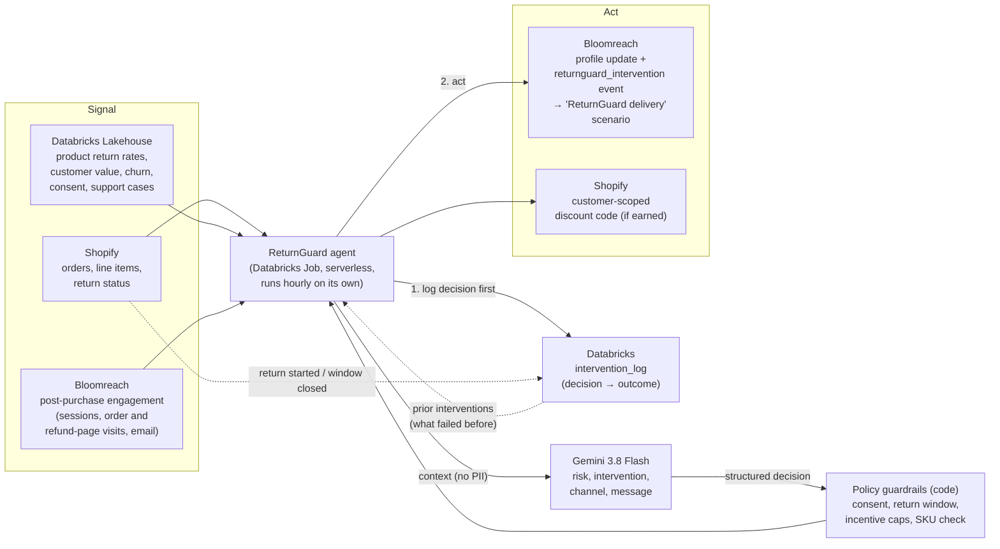

# ReturnGuard

**An autonomous post-purchase agent that notices when an order is about to be returned and steps in first.**
Composable AI Hackathon 2026, **Track 5: Behavioral signal and intervention agents**. Team **Frontier**.

A single signal such as "this product gets returned a lot" is noise. ReturnGuard only acts when signals from
different systems line up. For example: a product with an 8.8% return rate (Databricks), bought by a customer
who has returned before (Databricks), who then visited the refund-policy page and stopped opening email
(Bloomreach), on an order still inside its return window (Shopify). It then chooses the cheapest intervention
likely to work (fit guidance, usage tips, an exchange, proactive support, or only for high-value customers a small
capped incentive), delivers it through Bloomreach, and learns from whether the item came back.

## Architecture



Each run the agent:

1. **Closes the loop.** For every pending decision, it checks Shopify: was a return started (`returned`), or has
   the 30-day window passed (`kept`)? It writes the outcome to Databricks and records a `returnguard_outcome`
   event in Bloomreach.
2. **Detects.** It pulls recent Shopify orders and skips any that are already decided, already returned or
   outside the window.
3. **Assembles context.** It joins Databricks features (via the customer's email), Databricks product return
   rates (via the SKU), Bloomreach engagement events and the customer's prior interventions and their outcomes.
4. **Decides.** Gemini returns a structured decision (JSON schema), and code-enforced policy then corrects or
   blocks it: no marketing consent means no contact; a closed window means no contact; a SKU not in the order
   means no contact; incentives are allowed only for `keep_incentive` and are capped by customer value tier
   (5 / 10 / 15%).
5. **Acts.** It logs the decision to Databricks *before* acting, so the customer is never contacted twice. It
   then updates the Bloomreach profile and records the `returnguard_intervention` event, which the Bloomreach
   scenario turns into the message. If Gemini earned an incentive, it creates a single-use, customer-scoped
   Shopify discount code.

## Repository layout

```
agent/                      Python agent
  src/returnguard/
    agent.py                The loop: resolve outcomes → detect → assemble → decide → act
    context.py              Runtime context schema; each field annotated with its source system
    decision.py             Structured decision schema Gemini must return
    reasoning.py            Gemini system prompt and decide()
    policy.py               Code-enforced guardrails
    shopify.py              Admin GraphQL: orders, return status, discount codes (client-credentials auth)
    lakehouse.py            Databricks SQL warehouse: features in, decisions and outcomes out
    bloomreach.py           Engagement API: events in, profile updates and intervention events out
    engagement.py           Raw Bloomreach events → engagement signal
    gemini.py               Gemini adapter
  scripts/
    seed_demo.py            Demo data (simulated, see below)
    simulate_return.py      Demo the learning loop: return an order, then buy again
    reset_demo.py           Clear demo decisions to re-run the demo from scratch
    deploy_databricks.py    Deploy as a scheduled Databricks Job (secret scope + upload + job)
    inspect_module.py       Read-only look inside each module against the live systems
  tests/                    91 tests, 98% coverage
databricks/returnguard_setup.sql   Views + intervention_log table (team schema)
bloomreach/returnguard_email.html  Email template for the delivery scenario
frontier/                   Shopify app (permissions, installed on the dev store)
docs/SUBMISSION.md          Hackathon submission brief
docs/WALKTHROUGH.md         Hands-on tour: test and understand every module
```

## Setup

Prerequisites: Python 3.11+ with [uv](https://docs.astral.sh/uv/), Node 22.12+, Shopify CLI 4.8+.

1. **Configuration.** Copy `.env.example` to `agent/.env` and fill it in. Never commit it.
2. **Shopify.** Create the dev store (`shopify store create dev --plan plus --demo-data`). Then run
   `cd frontier && shopify app deploy`, set the app's distribution to **Custom** for your store and install it.
   Copy the client ID and secret from `shopify app env show` into `agent/.env`.
3. **Databricks.** Run `databricks/returnguard_setup.sql` in the SQL editor against your schema. The agent
   signs in through the browser on first use.
4. **Bloomreach.** Create a private API key with Get and Set on customer properties and events. Create a scenario
   that has the trigger *On event* `returnguard_intervention` and an Email action using
   `bloomreach/returnguard_email.html`.
5. **Install and test.**
   ```bash
   cd agent
   uv sync
   uv run pytest
   ```

## Deploying (runs by itself)

```bash
cd agent
uv run --env-file .env python scripts/deploy_databricks.py --run-now
```

This stores every setting in the Databricks secret scope `returnguard` and uploads the package to your workspace.
It then creates the job **ReturnGuard agent** (serverless, hourly) and runs it once. Inside the job, the agent uses the
job's own Databricks identity, so no browser login is involved. The entry point is `returnguard/jobs.py`.

## Running locally

```bash
cd agent
uv run --env-file .env returnguard run                      # one cycle
uv run --env-file .env returnguard watch --interval 3600    # autonomous, every hour
uv run --env-file .env returnguard decide tests/fixtures/sample_context.json   # one Gemini decision, no side effects
```

Demo flow:

```bash
uv run --env-file .env python scripts/seed_demo.py              # 3 real Databricks customers → Shopify test orders + Bloomreach events
uv run --env-file .env returnguard run                          # decisions for #1001, #1002, #1003
uv run --env-file .env python scripts/simulate_return.py 1001 --next-order
uv run --env-file .env returnguard run                          # #1001 recorded as returned; the new order gets a different intervention
```

## What is real and what is simulated

| Real (live at runtime) | Simulated (disclosed) |
|---|---|
| Databricks: hackathon synthetic customers, products, transactions, refunds, churn scores; our views and decision log | Shopify orders are **test orders** (Bogus gateway) created by `seed_demo.py` for 3 real Databricks customers |
| Gemini decisions and messages, live on every run | Bloomreach storefront events (sessions, page visits, email opens) for those customers, tagged `simulated: true`, because the dev store has no Bloomreach tracking |
| Shopify Admin API: order reads, return status, discount codes | The return in the demo is created by `simulate_return.py` |
| Bloomreach: profile updates, intervention and outcome events, a live scenario | Email is **not delivered**: no email integration in the sandbox, and demo addresses are `@example.test` |
| Policy guardrails and the learning loop | |
| Hosting: a scheduled **Databricks Job** (serverless, hourly). Settings are read from a Databricks secret scope, and the job authenticates with its own identity. | |
